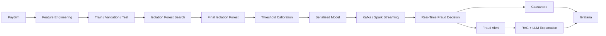

# Isolation Forest Fraud Detection

## Overview

This repository contains the Isolation Forest experiment used in the PaySim-based real-time financial fraud-detection project.

The notebook is structured as an engineering experiment rather than a collection of disconnected code blocks. It covers the complete offline model-development path:

```text
PaySim
   |
   v
Data quality checks
   |
   v
Feature engineering
   |
   v
Train / validation / test split
   |
   v
Normal-only Isolation Forest training
   |
   v
Controlled hyperparameter search
   |
   v
Final model retraining
   |
   v
Anomaly-score generation
   |
   v
Validation threshold calibration
   |
   v
Final test evaluation
   |
   v
Error analysis and runtime measurement
   |
   v
Model serialization
```

The current experiment is designed for later integration with Kafka and Spark Structured Streaming.

---

# 1. What this experiment is trying to solve

The objective is to detect transactions that look unusual compared with the legitimate transaction population.

Isolation Forest is used as an **anomaly detector** rather than as a conventional supervised fraud classifier.

The training logic is:

```text
Legitimate training transactions
            |
            v
     Isolation Forest
            |
            v
 Learn structure of normal activity
            |
            v
 Score new transactions by anomaly
```

`isFraud` is retained as the ground-truth label for validation and testing. It is not used as a model feature.

---

# 2. Current experiment scope

The present experiment uses:

| Item | Value |
|---|---:|
| Rows loaded | 500,000 |
| Features | 19 |
| Train split | 60% |
| Validation split | 20% |
| Test split | 20% |
| Search sample | 100,000 legitimate training rows |
| Final training data | All legitimate rows in the training partition |
| Random state | 42 |

### Important scope note

This experiment processes a **500,000-row subset** of the PaySim file. It is therefore a controlled modeling experiment and should not be described as a full-dataset training result.

---

# 3. Feature engineering

The raw PaySim schema is converted into 19 model-ready features.

## Final feature list

```text
01. step
02. amount
03. oldbalanceOrg
04. newbalanceOrig
05. oldbalanceDest
06. newbalanceDest
07. orig_balance_change
08. dest_balance_change
09. orig_balance_error
10. dest_balance_error
11. orig_zero_after
12. dest_zero_before
13. dest_zero_after
14. log_amount
15. type_CASH_IN
16. type_CASH_OUT
17. type_DEBIT
18. type_PAYMENT
19. type_TRANSFER
```

## Main transformations

### Origin balance movement

```text
orig_balance_change
= oldbalanceOrg - newbalanceOrig
```

### Destination balance movement

```text
dest_balance_change
= newbalanceDest - oldbalanceDest
```

### Balance discrepancy features

```text
orig_balance_error
= amount - orig_balance_change

dest_balance_error
= amount - dest_balance_change
```

### Account-state indicators

```text
orig_zero_after
= (newbalanceOrig == 0)

dest_zero_before
= (oldbalanceDest == 0)

dest_zero_after
= (newbalanceDest == 0)
```

### Amount transformation

```text
log_amount = log1p(amount)
```

### Transaction type

The raw `type` field is one-hot encoded into:

```text
type_CASH_IN
type_CASH_OUT
type_DEBIT
type_PAYMENT
type_TRANSFER
```

---

# 4. Columns deliberately excluded from model input

The following columns remain outside the Isolation Forest feature matrix:

```text
isFraud
isFlaggedFraud
nameOrig
nameDest
```

## `isFraud`

Ground truth used for model evaluation.

## `isFlaggedFraud`

Existing PaySim flag. It is not used as an input feature in this experiment.

## `nameOrig` and `nameDest`

Account identifiers. The current model uses transaction and balance behavior rather than directly using these identifiers.

---

# 5. Train / validation / test design

The data is split using stratification:

```text
                      PaySim subset
                         500,000
                            |
                            v
                 +----------+----------+
                 |                     |
                80%                   20%
                 |                     |
          Train + Validation          Test
                 |
                 v
           75%       25%
            |         |
            v         v
         Training  Validation
            |
            v
    Legitimate transactions only
```

This preserves the class distribution as closely as possible between the partitions.

The test set is reserved for the final evaluation.

---

# 6. Why legitimate-only training is used

The current Isolation Forest setup is anomaly-based.

The model is trained on:

```text
Legitimate transactions
```

rather than directly learning:

```text
Fraud vs legitimate
```

The training objective is therefore closer to:

> Learn the structure of normal financial activity and identify transactions that are isolated from that structure.

This makes the separation between training and evaluation important:

```text
X_train_normal
    -> model training

y_val
    -> validation threshold selection

y_test
    -> final evaluation
```

---

# 7. Baseline model

The baseline configuration is:

```text
n_estimators = 200
max_samples = "auto"
max_features = 1.0
contamination = "auto"
bootstrap = False
random_state = 42
```

The baseline establishes a reference point before trying alternative configurations.

---

# 8. Hyperparameter search

Five configurations are evaluated:

| Configuration | Trees | Max samples | Max features |
|---|---:|---:|---:|
| IF_200_auto | 200 | auto | 1.0 |
| IF_500_auto | 500 | auto | 1.0 |
| IF_500_half_features | 500 | auto | 0.5 |
| **IF_500_half_samples** | **500** | **0.5** | **1.0** |
| IF_800_half_features | 800 | auto | 0.5 |

The search evaluates each model using validation anomaly scores and a range of candidate thresholds.

For each configuration, the notebook records:

- validation precision
- validation recall
- validation F1
- training time
- validation threshold

---

# 9. Hyperparameter search result

Current recorded validation results:

| Configuration | F1 | Recall | Precision | Time |
|---|---:|---:|---:|---:|
| IF_200_auto | 0.0522 | 0.1957 | 0.0301 | 0.59 s |
| IF_500_auto | 0.0650 | 0.1739 | 0.0400 | 1.35 s |
| IF_500_half_features | 0.0522 | 0.1957 | 0.0301 | 1.86 s |
| **IF_500_half_samples** | **0.2055** | **0.3261** | **0.1500** | 3.71 s |
| IF_800_half_features | 0.0541 | 0.1739 | 0.0320 | 2.90 s |

The selected configuration is therefore:

```text
IF_500_half_samples

n_estimators = 500
max_samples  = 0.5
max_features = 1.0
```

This is a **relative selection among the tested configurations**. The F1 value should not be described as intrinsically high or low without additional context.

---

# 10. Final model

After configuration selection, the model is retrained using all legitimate transactions in the training partition.

Current final configuration:

```text
Isolation Forest
├── 500 trees
├── max_samples = 0.5
├── max_features = 1.0
├── contamination = auto
├── bootstrap = False
└── random_state = 42
```

Recorded final training time:

```text
16.77 seconds
```

---

# 11. Anomaly score

The model produces a continuous anomaly score.

The notebook uses:

```python
anomaly_score = -decision_function(transaction)
```

so that the working interpretation is:

```text
Lower score  -> more normal-like
Higher score -> more anomalous
```

The anomaly score is **not a fraud probability**.

The score must be converted into an operational alert using a threshold.

---

# 12. Threshold calibration

Threshold selection is performed on the validation set.

For every candidate threshold, the notebook calculates:

```text
Precision
Recall
F1
True Positives
True Negatives
False Positives
False Negatives
```

The primary threshold-selection rule is:

```text
Choose the threshold with maximum validation F1
```

Current selected threshold:

```text
0.10719670
```

The resulting decision rule is:

```text
score < 0.10719670
        -> Normal

score >= 0.10719670
        -> Potential Fraud
```

A separate 95%-recall target is also tested. In the current candidate threshold search, no threshold reached the configured 95% validation recall target.

---

# 13. Final test results

Current test-set results:

| Metric | Value |
|---|---:|
| Precision | **0.1485** |
| Recall | **0.3191** |
| F1-score | **0.2027** |
| PR-AUC | **0.1950** |
| ROC-AUC | **0.8569** |
| True Positives | **15** |
| True Negatives | **99,867** |
| False Positives | **86** |
| False Negatives | **32** |
| False Positive Rate | **0.0860%** |
| False Negative Rate | **68.0851%** |

The test set contains 47 fraud cases in the current experiment:

```text
47 actual fraud
├── 15 detected
└── 32 missed
```

The false-negative result is an important limitation because the project places substantial importance on avoiding missed fraud.

---

# 14. Runtime results

Current measured runtime:

| Measure | Value |
|---|---:|
| Final training time | 16.77 sec |
| Test inference time | 6.25 sec |
| Average latency | 0.0625 ms / transaction |
| Observed throughput | 15,996.75 transactions / sec |

These are measurements from the current 100,000-row test inference experiment and should be reported as experimental observations rather than universal deployment capacity.

---

# 15. Visual analysis

The notebook includes several visual checks.

### Hyperparameter search


### Final metrics


### Confusion matrix


Additional plots are generated by the notebook after execution:

- validation threshold curves
- false-positive / false-negative comparison
- anomaly-score distributions
- ROC curve
- precision-recall curve
- runtime comparison

---

# 16. System architecture position

This notebook represents the **offline model-development stage** of the larger streaming system.



The core responsibilities are separated:

```text
Isolation Forest
    = anomaly detection

Threshold
    = operational alert cutoff

Cassandra
    = storage

RAG
    = contextual retrieval

LLM
    = alert explanation
```

---

# 17. Deployment artifacts

The notebook exports:

```text
models/
├── isolation_forest_final.pkl
├── isolation_forest_features.json
└── isolation_forest_config.json
```

and:

```text
results/
├── isolation_forest_final_results.json
├── isolation_forest_test_scores.csv
└── isolation_forest_search_results.csv
```

### `isolation_forest_final.pkl`

Serialized final Isolation Forest model.

### `isolation_forest_features.json`

Exact 19-feature order used by the model.

### `isolation_forest_config.json`

Contains configuration and threshold information.

### `isolation_forest_final_results.json`

Contains the final experiment metrics.

### `isolation_forest_test_scores.csv`

Contains test row index, actual label, anomaly score, and predicted label.

### `isolation_forest_search_results.csv`

Contains the hyperparameter-search results.

---

# 18. Project structure

A practical project layout is:

```text
Real-Time-Financial-Fraud-Detection-Pipeline-
│
├── data/
│   └── PS_20174392719_1491204439457_log.csv
│
├── notebooks/
│   ├── PaySim_Feature_Engineering.ipynb
│   ├── Isolation_Forest_Model_Test_Company_Ready.ipynb
│   ├── Autoencoder_Model_Test.ipynb
│   └── Model_Comparison_New.ipynb
│
├── models/
│   ├── isolation_forest_final.pkl
│   ├── isolation_forest_features.json
│   └── isolation_forest_config.json
│
├── results/
│   ├── isolation_forest_final_results.json
│   ├── isolation_forest_test_scores.csv
│   └── isolation_forest_search_results.csv
│
├── producer/
│   └── Kafka producer
│
├── streaming/
│   └── Spark Structured Streaming application
│
└── docs/
    └── figures/
```

---

# 19. How this connects to streaming inference

The production path should reproduce the same feature contract:

```text
Kafka JSON transaction
        |
        v
Feature engineering
        |
        v
Same 19 features
        |
        v
Serialized Isolation Forest
        |
        v
Anomaly score
        |
        v
Saved threshold
        |
        +------------------+
        |                  |
        v                  v
     Normal         Potential Fraud
                           |
                           v
                     Fraud Alert
```

The most important implementation rule is that the streaming feature transformation must match the offline feature engineering in:

- feature formulas
- feature names
- category encoding
- feature order
- data types

---

# 20. Limitations to keep visible

The current experiment has several limitations that should be explicitly acknowledged.

### Dataset scope

The current modeling run uses 500,000 rows rather than the complete PaySim file.

### Threshold performance

The F1-selected operating point still produces a high false-negative rate.

### Positive sample size in the test partition

The current test set contains 47 fraud observations, so differences between models or thresholds should be interpreted in the context of that sample size.

### Runtime interpretation

The reported throughput and latency are measurements of the current local experiment, not guaranteed production capacity.

---

# 21. Running the notebook

From the project root:

```powershell
.\.venv\Scripts\python.exe -m notebook
```

Open:

```text
Isolation_Forest_Model_Test_Company_Ready.ipynb
```

Run cells in order with:

```text
Shift + Enter
```

---

# 22. Closing summary

The current experiment establishes a reproducible Isolation Forest baseline-to-final-model workflow.

The selected configuration is:

```text
500 trees
max_samples = 0.5
max_features = 1.0
```

At the current F1-selected operating point, the test results are:

```text
Precision = 0.1485
Recall    = 0.3191
F1        = 0.2027
PR-AUC    = 0.1950
ROC-AUC   = 0.8569
```

The next stage is integration of the serialized model and exact feature contract into the real-time Kafka/Spark pipeline.
