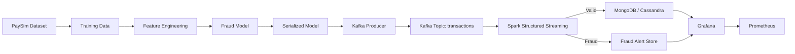

# Real-Time Financial Fraud Detection Pipeline

A real-time fraud detection system for streaming financial transactions, combining data ingestion, feature engineering, online model inference, and operational monitoring.

## Overview

This project is structured as a production-style financial risk platform. It uses a synthetic transaction dataset to train a fraud/anomaly detection model, streams transactions through Kafka, processes them with Apache Spark Structured Streaming, and exposes operational metrics via Prometheus and Grafana.

The system is designed to identify suspicious activity in near real time while keeping a clean separation between data processing, model inference, storage, and monitoring.

---

## Architecture

---

## Local Setup

### Prerequisites

- Python 3.10+
- Java 11+
- Kafka
- Apache Spark
- MongoDB or Cassandra
- Prometheus
- Grafana

### Environment configuration

Create a local environment file named [.env](.env) in the project root. This file holds your local machine settings and should not be committed to source control.

Use the sample configuration in [.env.example](.env.example) as the template.

### Quick start

1. Copy [.env.example](.env.example) to [.env](.env)
2. Update values for your local environment
3. Start Kafka, Spark, and your database services
4. Run the producer and streaming job
5. Open Grafana and Prometheus to review operational metrics

---

## Environment Variables

The project expects the following local settings:

- Kafka connection and topic names
- Spark app settings and checkpoint directory
- model path and training output folder
- MongoDB / Cassandra connection details
- alerting and monitoring endpoints
- anomaly threshold and model type

For a safe setup, keep machine-specific values in [.env](.env) and share only the example file in version control.

---

## Security note

Keep secrets and local-only configuration out of the repository. Use [.env](.env) locally and ignore it in Git.

---

## Tech Stack

- Python
- Kafka
- Apache Spark Structured Streaming
- MongoDB / Cassandra
- Grafana
- Prometheus
- Machine Learning: Isolation Forest / Autoencoder

---

## Expected Result

This pipeline provides a scalable, observable, real-time fraud detection workflow with ingestion, streaming inference, alerting, and operational monitoring.
